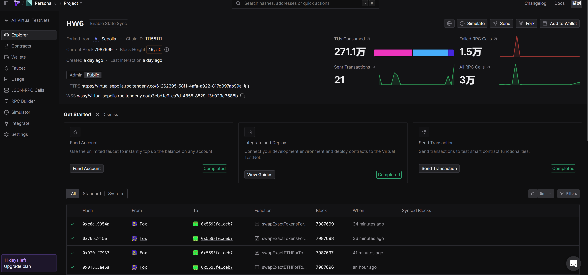
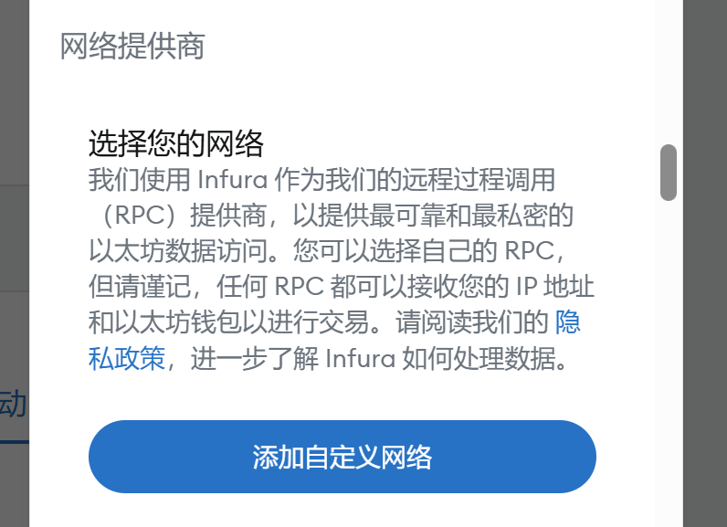
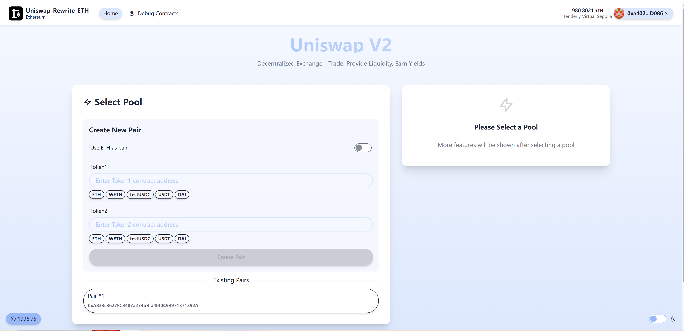
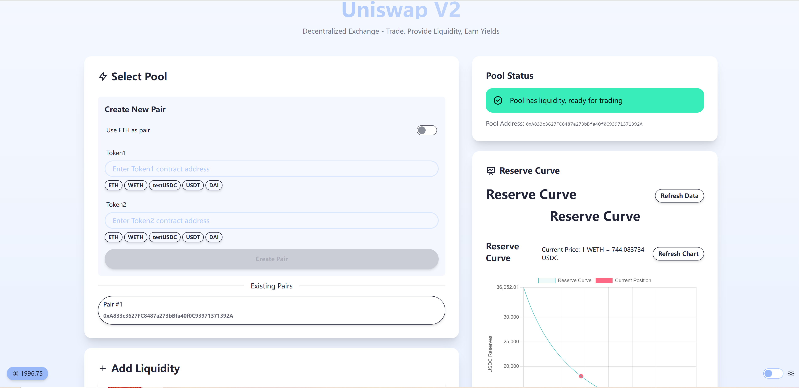
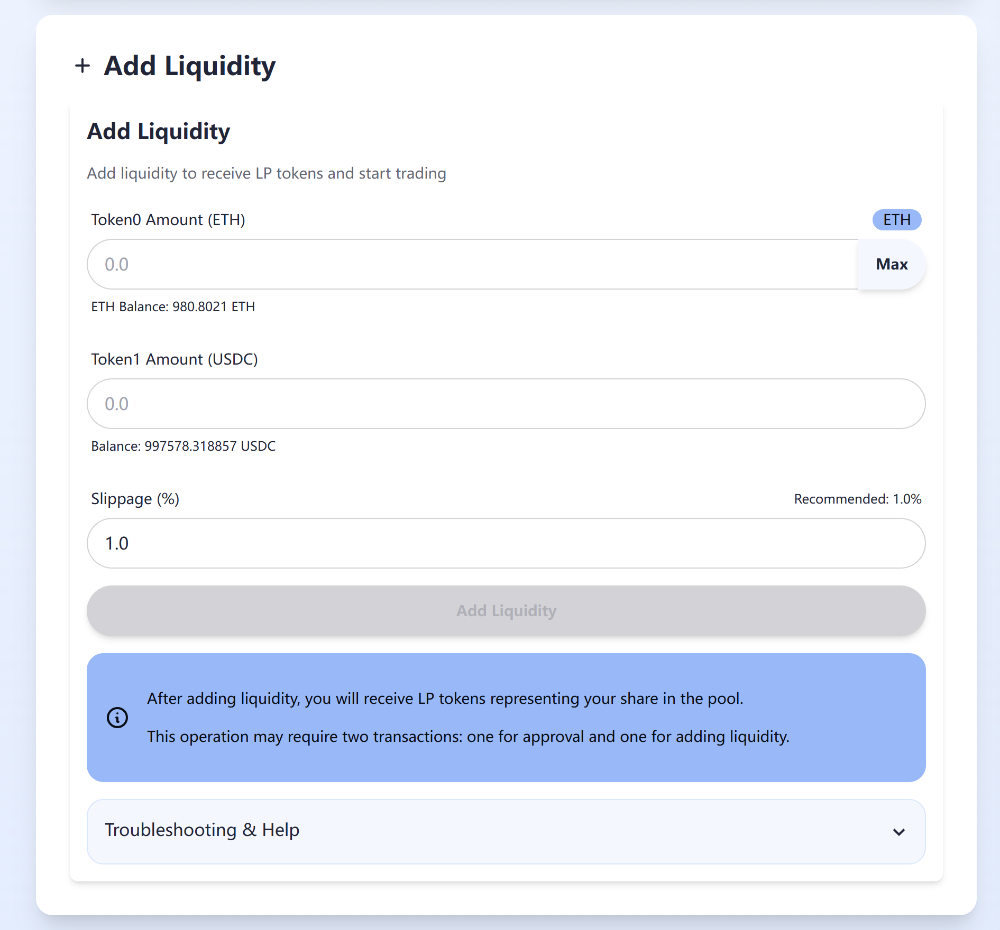
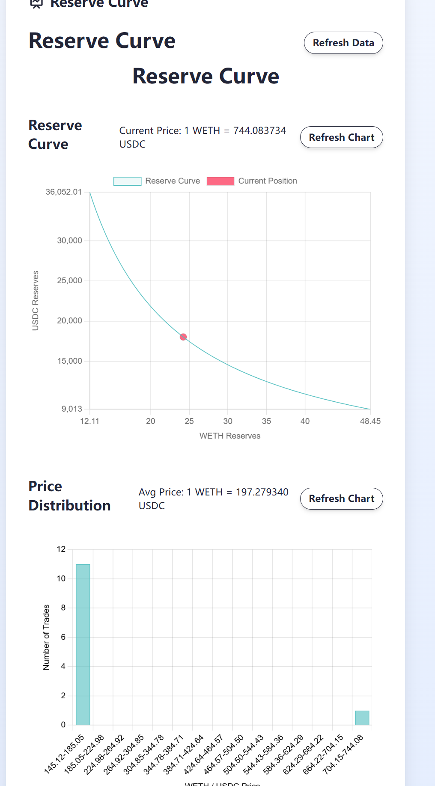
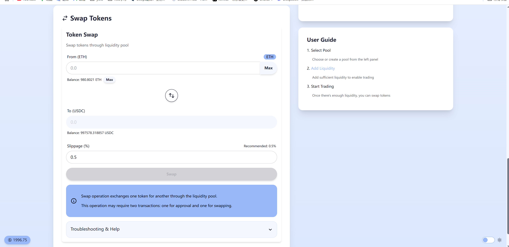
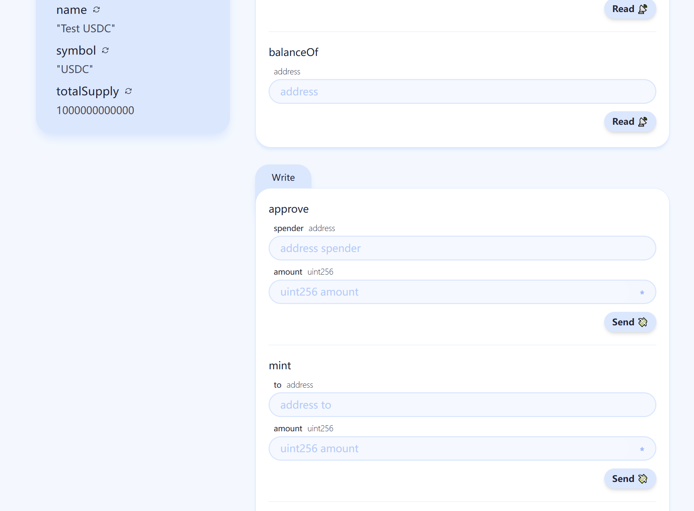

# Frontent for UniswapV2 Rewrite

## Links for this project

[HW6-Vercel](https://frontend-hw-6-nextjs.vercel.app/)

[HW6-Github](https://github.com/DiLiuNEUexpresscompany/frontend-HW6)

[Tenderly Public Link](https://virtual.sepolia.rpc.tenderly.co/61262395-58f1-4afa-a922-817d097ab99a)

## Tenderly virtual test net
Create a Tenderly virtual test net and deploy your contract on the test net



And deploy the contract use some scripts:

```sol
// SPDX-License-Identifier: MIT
pragma solidity ^0.8.19;

import "forge-std/Script.sol";
import "forge-std/console.sol";
import "../contracts/UniswapV2Factory.sol";
import "../contracts/UniswapV2Router02.sol";
import "../contracts/test/WETH.sol";
import "../contracts/test/TestUSDC.sol";
import "../contracts/UniswapV2ERC20.sol";
import "../contracts/UniswapV2Pair.sol";
import "../contracts/UniswapV2Migrator.sol";

contract DeployScript is Script {
    function run() external {
        uint256 deployerPrivateKey = vm.envUint("PRIVATE_KEY");
        address deployerAddress = vm.addr(deployerPrivateKey);
        console.log("Deployer address: ", deployerAddress);
        
        vm.startBroadcast(deployerPrivateKey);
        
        // Deploy libraries first
        // Note: In your case, you're already referencing deployed libraries
        // But we'll add the deployment code here for completeness
        
        console.log("Deploying Math library...");
        address mathLib = deployCode("contracts/libraries/Math.sol:Math");
        console.log("Math library deployed at: ", mathLib);
        
        console.log("Deploying TransferHelper library...");
        address transferHelperLib = deployCode("contracts/libraries/TransferHelper.sol:TransferHelper");
        console.log("TransferHelper library deployed at: ", transferHelperLib);
        
        console.log("Deploying UniswapV2Library library...");
        address uniswapV2Lib = deployCode("contracts/libraries/UniswapV2Library.sol:UniswapV2Library");
        console.log("UniswapV2Library library deployed at: ", uniswapV2Lib);
        
        // Deploy test tokens
        console.log("Deploying WETH...");
        WETH weth = new WETH();
        console.log("WETH deployed at: ", address(weth));
        
        console.log("Deploying TestUSDC...");
        TestUSDC testUSDC = new TestUSDC();
        console.log("TestUSDC deployed at: ", address(testUSDC));
        
        // Deploy main contracts
        console.log("Deploying UniswapV2Factory...");
        UniswapV2Factory factory = new UniswapV2Factory(deployerAddress);
        console.log("UniswapV2Factory deployed at: ", address(factory));
        
        console.log("Deploying UniswapV2Router02...");
        UniswapV2Router02 router = new UniswapV2Router02(address(factory), address(weth));
        console.log("UniswapV2Router02 deployed at: ", address(router));
        
        // Deploy additional contracts if needed
        console.log("Deploying UniswapV2Migrator...");
        UniswapV2Migrator migrator = new UniswapV2Migrator(address(factory), address(router));
        console.log("UniswapV2Migrator deployed at: ", address(migrator));
        
        // Initialize a liquidity pool between WETH and TestUSDC
        console.log("Creating WETH/TestUSDC pair...");
        address pair = factory.createPair(address(weth), address(testUSDC));
        console.log("WETH/TestUSDC pair created at: ", pair);
        
        // Mint some test tokens to the deployer
        console.log("Minting test tokens...");
        testUSDC.mint(deployerAddress, 1000000 * 10**6); // 1M USDC
        
        // Approve router to spend tokens
        testUSDC.approve(address(router), type(uint256).max);
        
        // Add initial liquidity
        console.log("Adding initial liquidity...");
        uint256 wethAmount = 10 ether;
        uint256 usdcAmount = 20000 * 10**6; // 20k USDC
        
        // Wrap ETH to WETH
        weth.deposit{value: wethAmount}();
        weth.approve(address(router), type(uint256).max);
        
        // Add liquidity
        router.addLiquidity(
            address(weth),
            address(testUSDC),
            wethAmount,
            usdcAmount,
            0, // min WETH
            0, // min USDC
            deployerAddress,
            block.timestamp + 3600 // deadline: 1 hour from now
        );
        
        console.log("Initial liquidity added successfully");
        
        vm.stopBroadcast();
    }
}
```

forge script script/DeployRouter.s.sol:DeployRouter --rpc-url="https://virtual.sepolia.rpc.tenderly.co/a6122906-66f1-4c1a-b4e7-92fecdcd0e25" --libraries contracts/libraries/Math.sol:Math:0xc5674330f3bff50cc49709ad072de0f8b0421fee --libraries contracts/libraries/TransferHelper.sol:TransferHelper:0x0241ce2f387424cedf0c45baa6e7c98d4c71e6b4 --libraries contracts/libraries/UniswapV2Library.sol:UniswapV2Library:0xbe185501d40f9d70d0a9dd2891769af108e5a862 --broadcast --verify --etherscan-api-key=7bcJGsmnOnK2bDapyuEuMxWkv4WPHEUS --verifier-url="https://virtual.sepolia.rpc.tenderly.co/a6122906-66f1-4c1a-b4e7-92fecdcd0e25/verify/etherscan"


forge script script/Deploy.s.sol:DeployRouter   --rpc-url="https://virtual.sepolia.rpc.tenderly.co/a6122906-66f1-4c1a-b4e7-92fecdcd0e25"   --libraries contracts/libraries/Math.sol:Math:0xc5674330f3bff50cc49709ad072de0f8b0421fee   --libraries contracts/libraries/TransferHelper.sol:TransferHelper:0x0241ce2f387424cedf0c45baa6e7c98d4c71e6b4   --libraries contracts/libraries/UniswapV2Library.sol:UniswapV2Library:0xbe185501d40f9d70d0a9dd2891769af108e5a862   --broadcast   --verify   --etherscan-api-key=7bcJGsmnOnK2bDapyuEuMxWkv4WPHEUS   --verifier-url="https://virtual.sepolia.rpc.tenderly.co/a6122906-66f1-4c1a-b4e7-92fecdcd0e25/verify/etherscan"forge script script/DeployRouter.s.sol:DeployRouter --rpc-url="https://virtual.sepolia.rpc.tenderly.co/a6122906-66f1-4c1a-b4e7-92fecdcd0e25" --libraries contracts/libraries/Math.sol:Math:0xc5674330f3bff50cc49709ad072de0f8b0421fee --libraries contracts/libraries/TransferHelper.sol:TransferHelper:0x0241ce2f387424cedf0c45baa6e7c98d4c71e6b4 --libraries contracts/libraries/UniswapV2Library.sol:UniswapV2Library:0xbe185501d40f9d70d0a9dd2891769af108e5a862 --broadcast --verify --etherscan-api-key=7bcJGsmnOnK2bDapyuEuMxWkv4WPHEUS --verifier-url="https://virtual.sepolia.rpc.tenderly.co/a6122906-66f1-4c1a-b4e7-92fecdcd0e25/verify/etherscan"


forge verify-contract 0x6af0cd1a42640486957af1a7441608427fabb861 contracts/UniswapV2Router02.sol:UniswapV2Router02 --constructor-args $(cast abi-encode "constructor(address,address)" 0x8a2144B5baF0B2C8807dE8e0Fa82156cD0DEA8DC 0x764ac516ec320A310375E69F59180355c69e313f) --verifier-url https://virtual.sepolia.rpc.tenderly.co/a6122906-66f1-4c1a-b4e7-92fecdcd0e25/verify/etherscan --etherscan-api-key 7bcJGsmnOnK2bDapyuEuMxWkv4WPHEUS --chain-id 11155111

Then run codes to deploy the contracts.
```bash
source .env
forge script script/DeployAll.s.sol:DeployScript --rpc-url="https://virtual.sepolia.rpc.tenderly.co/a6122906-66f1-4c1a-b4e7-92fecdcd0e25" --broadcast --verify --etherscan-api-key= --verifier-url="https://virtual.sepolia.rpc.tenderly.co/a6122906-66f1-4c1a-b4e7-92fecdcd0e25/verify/etherscan"
``` 

## How to connect your wallet to HW6

1. Click on the network dropdown menu at the top of the MetaMask interface (it typically shows "Ethereum Mainnet" by default).

2. Click on "Security and Privacy" at the bottom of the dropdown menu.

3. Select "Network Providers"

4. Fill in the network details:
   - Network Name: Enter a name for the network (e.g., "My Custom Network")
   - New RPC URL: Enter the RPC endpoint URL before [Tenderly Public Link](https://virtual.sepolia.rpc.tenderly.co/61262395-58f1-4afa-a922-817d097ab99a)（**Maybe I can't join the network without authorization because of the permissions settings.**）
   - Chain ID: Enter the network's chain ID (a unique number identifying the blockchain)
   - Currency Symbol: Enter the symbol for the native currency (e.g., "ETH", "MATIC")
   - Block Explorer URL (optional): Enter the URL for the network's block explorer

6. Click "Save" to add the network.




## HW6 interface
















